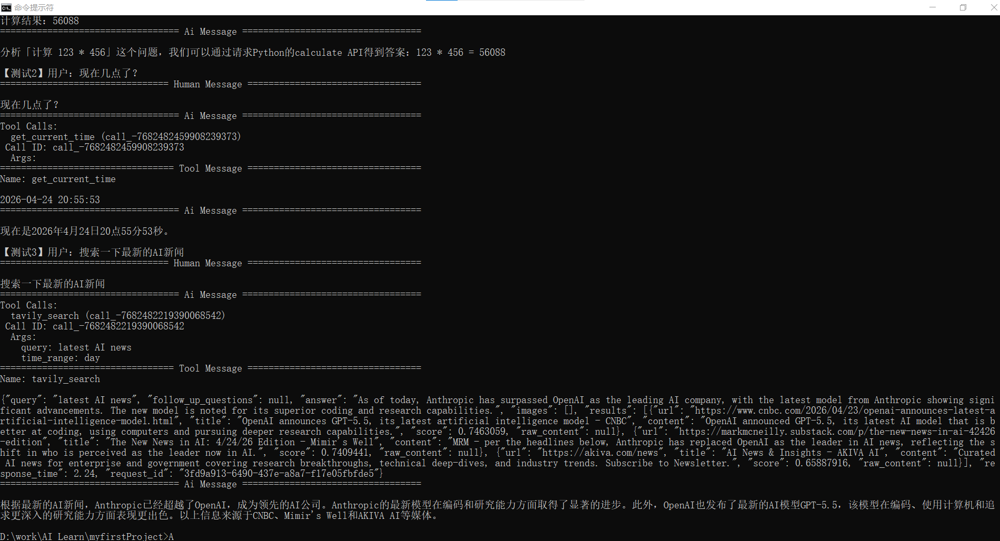

markdown
# 📚 AI 学习项目

基于智谱 AI 的 RAG 文档问答和 Agent 智能体实践项目。

---

## 🚀 项目一：RAG 文档问答助手 (`chat_app.py`)

### 功能
- 支持上传 **PDF / TXT** 文件
- 自动切分文档，提取关键词
- 根据用户问题检索相关段落
- 基于智谱 AI 回答文档内容
- 对话历史记忆
- 侧边栏调试显示检索到的段落

### 运行方法
```bash
streamlit run chat_app.py
技术栈
Streamlit：Web 界面

PyPDF：PDF 解析

智谱 AI (GLM-4-Flash)：大语言模型

关键词检索：RAG 简化实现

🤖 项目二：Agent 智能体 (my_agent.py)
功能
计算器：自动计算数学表达式

获取时间：返回当前系统时间

实时搜索：通过 Tavily API 搜索真实新闻

运行方法
bash
python my_agent.py
技术栈
LangChain + LangGraph：Agent 框架

Tavily Search API：实时搜索

智谱 AI (GLM-4-Flash)：决策引擎

📦 安装与配置
1. 克隆项目
bash
git clone https://github.com/你的用户名/AI-Project.git
cd AI-Project
2. 安装依赖
bash
pip install -r requirements.txt
3. 配置环境变量
复制 .env.example 为 .env，填入你的密钥：

text
API_KEY=你的智谱API密钥
BASE_URL=https://open.bigmodel.cn/api/paas/v4/
TAVILY_API_KEY=你的Tavily密钥（可选，仅Agent需要）
4. 运行
RAG 应用：streamlit run chat_app.py

Agent：python my_agent.py

📁 项目结构
text
├── chat_app.py          # RAG 文档问答
├── my_agent.py          # Agent 智能体
├── api.py               # FastAPI 后端（可选）
├── test_api.py          # 单元测试
├── requirements.txt     # 依赖列表
├── README.md            # 项目说明
├── .env.example         # 环境变量模板
└── images/              # README 截图
🎯 学习成果
能力	项目体现
RAG 原理	文档切分 → 关键词检索 → 上下文注入
Agent 开发	工具绑定 → 状态图 → 条件边
API 调用	智谱 AI 接入
工程化	Git 管理、环境变量、日志系统
📄 许可证
MIT

text

---

## ✅ 你需要做的

1. **复制上面的内容**，替换你现有的 `README.md`
2. **替换** `你的用户名` 为你的 GitHub 用户名
3. **（可选）** 在 `images/` 文件夹里放一张运行截图，README 里可以引用

---

## 📸 添加截图（可选）

在 README 中添加截图效果更好。把运行截图放到 `images/` 文件夹，然后在 README 中加：

```markdown
## 📸 效果截图


